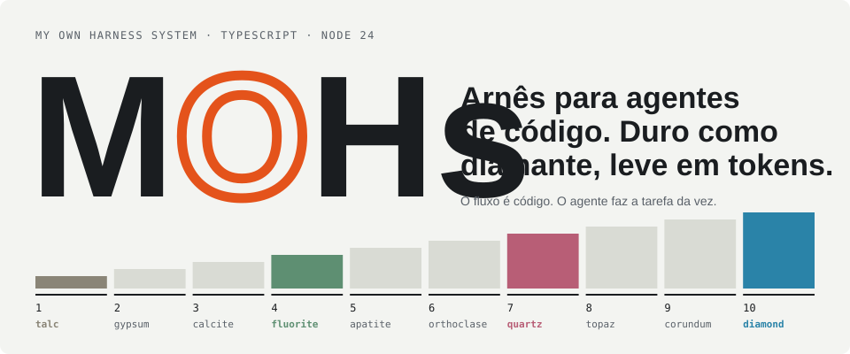
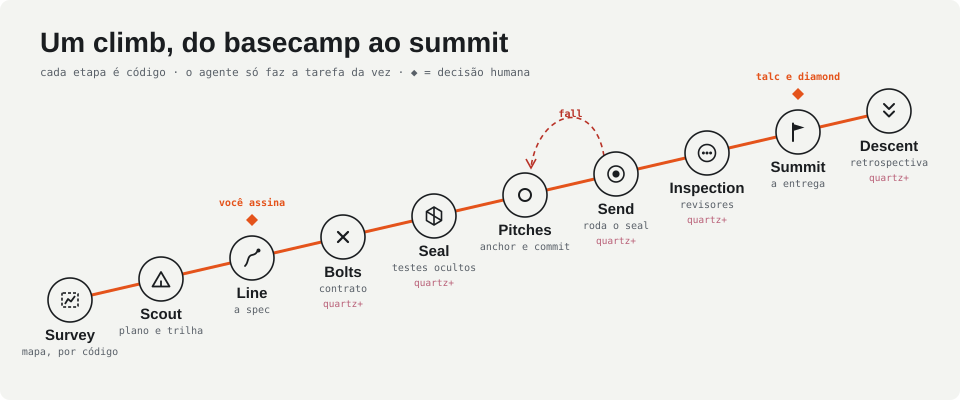
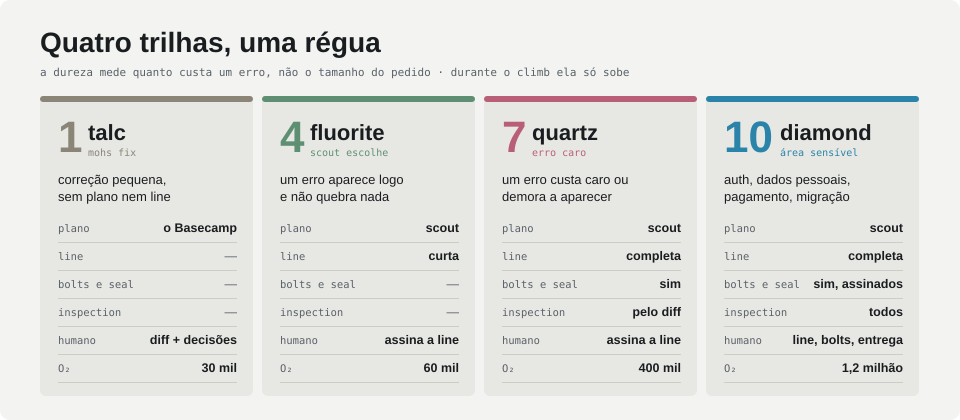
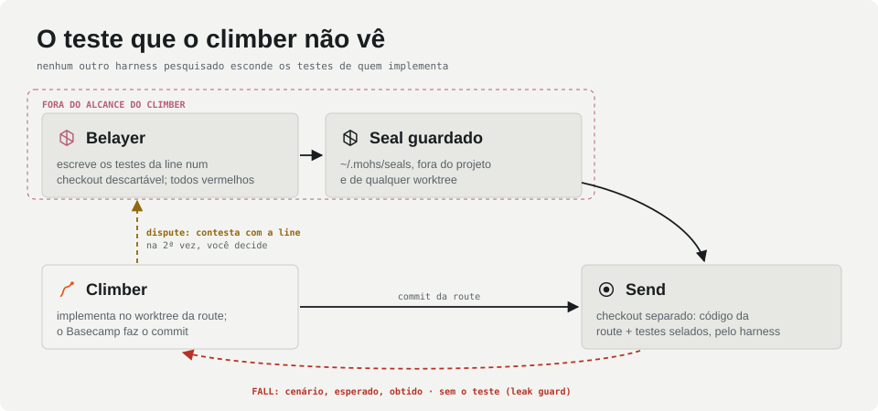

<picture>
  <source media="(prefers-color-scheme: dark)" srcset="docs/assets/readme/hero-dark.svg">
  
</picture>

**MOHs** conduz agentes de código (Claude Code, Copilot, um subagente, um loop próprio com Claude ou Kimi) do pedido à entrega. O fluxo é uma state machine em TypeScript: o agente faz uma tarefa por vez, e quem roda as checagens, faz os commits e decide o próximo passo é o harness.

O nome se lê como **Mohs**, a escala de dureza dos minerais; e _harness_, na escalada, é o arnês que segura quem sobe. Cada pedido é um **climb**, cada feature uma **route**, e a dureza (**hardness**) decide quanto rigor o harness aplica.

`Node 24` · `TypeScript sem build` · `Claude Code e Copilot` · `git como detalhe interno` · `pt-BR`

---

## Por que usar

|                                       |                                                                                                                                                                                   |
| ------------------------------------- | --------------------------------------------------------------------------------------------------------------------------------------------------------------------------------- |
| **Testes que o implementador não vê** | Um agente separado (o belayer) escreve os testes antes do código; eles ficam fora do projeto e rodam num checkout separado. Quem implementa recebe só o comportamento que falhou. |
| **Gates em código, não em prompt**    | Anchor, send, inspeção e brake rodam no harness. O agente nunca diz "os testes passaram": quem roda é o Basecamp.                                                                 |
| **Cerimônia na medida do pedido**     | Quatro trilhas, de `talc` a `diamond`. Uma correção pequena (`mohs fix`) custa uma tarefa de agente; uma área sensível pede assinaturas e todos os revisores.                     |
| **Você decide só o que importa**      | A spec (line) é assinada presa a um hash; as decisões que o pedido não deixou claras aparecem para você; todo summit diz o que o provou.                                          |
| **Seu working copy fica intacto**     | Cada route sobe num git worktree próprio. A entrega é uma branch que junta as routes e roda os testes de todas, pronta para `git merge`.                                          |
| **Qualquer agente, tudo registrado**  | O núcleo não sabe quem faz a tarefa: um agente pela CLI, o loop próprio por API ou uma equipe simulada. Log de eventos, painel ao vivo (Lookout) e relatório de cada climb.       |

## Um climb

<picture>
  <source media="(prefers-color-scheme: dark)" srcset="docs/assets/readme/flow-dark.svg">
  
</picture>

O **survey** mapeia o projeto por código, sem gastar tokens. O **scout** divide o pedido em routes e pitches e escolhe a trilha. A **line** (a spec) espera a sua assinatura. Acima de fluorite, cada route recebe **bolts** (o contrato de interface) e um **seal** (os testes escondidos) e sobe assim que ela e as routes de que depende estão prontas. Cada **pitch** termina numa **anchor**: o harness roda as checagens e faz o commit. O **send** roda o seal; se falhar, é uma **fall**, e o climber volta à última anchor sabendo só o comportamento esperado. Depois vêm os revisores (**inspection**), o **summit** e o **descent**, onde o scribe propõe melhorias que você aceita ou não.

## Quatro trilhas, uma régua

<picture>
  <source media="(prefers-color-scheme: dark)" srcset="docs/assets/readme/tracks-dark.svg">
  
</picture>

O scout escolhe entre fluorite, quartz e diamond; `--hardness` força. **Talc** só existe quando você pede (`mohs fix`): o climber faz a correção direto, lista as decisões que tomou, e o Basecamp confere o diff contra limites de tamanho e áreas sensíveis. Passou dos limites, a correção pede o fluxo completo. Durante o climb, a dureza só sobe.

## O teste que o climber não vê

<picture>
  <source media="(prefers-color-scheme: dark)" srcset="docs/assets/readme/seal-dark.svg">
  
</picture>

Entre os harnesses que pesquisamos (BMAD, AI-DLC, Superpowers, Spec Kit, Kiro, OpenSpec e outros), nenhum esconde os testes de quem implementa. O MOHs esconde: o belayer escreve contra a line e os bolts, o harness confere que todo teste falha antes da implementação, e a explicação de cada fall passa por um **leak guard** que barra trechos do teste. Se o climber achar que o teste contradiz a line, ele contesta (`dispute`); o belayer mantém ou corrige, e na segunda contestação quem decide é você.

---

## Começar

Precisa de **Node 24** (roda `.ts` direto) e **git**. Enquanto o pacote não é publicado, use `node src/cli.ts` no lugar de `mohs`, com `--cwd` apontando para o projeto.

```bash
npm install
node src/cli.ts init --cwd ../meu-projeto
```

O `init` cria `.mohs/` com os comandos detectados e um **plano de testes**: o que roda os testes selados agora (o runner do projeto ou o da linguagem) e o que é recomendado para a stack, com o comando para instalar.

Para o agente seguir o MOHs (skill e hooks de Claude Code ou Copilot):

```bash
node src/cli.ts agent install claude --cwd ../meu-projeto
```

No agente, dentro do projeto:

```bash
mohs climb "Adicionar prioridade às tarefas, com filtro na listagem" --detach
```

A saída já traz a primeira tarefa. O agente faz o que ela pede e responde com `mohs call …`; cada resposta volta com o próximo passo. Quando é a sua vez, a CLI diz o que revisar e o comando para assinar.

Uma correção pequena, sem plano nem line:

```bash
mohs fix "O botão Exportar deve dizer Exportar PNG" --detach
```

Para ver tudo sem agente nenhum, com a equipe simulada e o Lookout no navegador:

```bash
node src/cli.ts climb --crew fake --cwd gym/demo
```

## Comandos

| Comando                                 | Para quê                                                                                             |
| --------------------------------------- | ---------------------------------------------------------------------------------------------------- |
| `mohs init [--tests <opção>]`           | cria `.mohs/`, detectando comandos, guidebooks e o plano de testes                                   |
| `mohs doctor`                           | valida a configuração e mostra camadas, rack, brake, O₂ e o plano de testes                          |
| `mohs croqui [--show]`                  | desenha o croqui do projeto (intenção, entidades, áreas sensíveis), assinado por você                |
| `mohs climb "<pedido>"`                 | começa um climb (`--detach` para agentes, `--crew` para escolher a equipe, `--hardness` para forçar) |
| `mohs fix "<pedido>"`                   | correção pequena (talc): uma tarefa de climber, assinada no fim                                      |
| `mohs next`                             | o que o climb precisa agora: tarefa, quadro de tarefas, vez do humano ou fim                         |
| `mohs call <resposta>`                  | responde a tarefa aberta (`plan`, `line`, `safe`, `dispute`, `escalate`…)                            |
| `mohs sign [alvo]` / `mohs rescue <op>` | assina o que está pendente (line, `bolts-A`, `summit-A`, `croqui`) / responde um rescue              |
| `mohs climb --resume <id>`              | retoma um climb cujo Basecamp parou, sem refazer o que estava pronto                                 |
| `mohs lookout`                          | sobe o painel ao vivo dos climbs do projeto                                                          |
| `mohs report`                           | gera um `index.html` com a linha do tempo, o plano e as decisões de um climb                         |
| `mohs beta [accept\|reject <id>]`       | mostra as propostas do scribe e aplica ou descarta cada uma                                          |
| `mohs agent [install claude\|copilot]`  | instruções para o agente; `install` põe a skill e os hooks no projeto                                |
| `mohs rack <papel> --files a,b`         | mostra o que entraria no contexto (pack) de um papel                                                 |

## Quem faz o quê

| Papel         | Faz                                                           | Nunca                                    |
| ------------- | ------------------------------------------------------------- | ---------------------------------------- |
| **scout**     | lê o pedido e o repositório, planeja routes, pitches e trilha | altera arquivos                          |
| **setter**    | escreve a line e os bolts                                     | escreve código                           |
| **belayer**   | escreve os testes selados e explica as falls                  | mostra um teste a quem implementa        |
| **climber**   | implementa um pitch por vez, no worktree da route             | faz commit ou diz que os testes passaram |
| **inspector** | revisa o diff com uma rubrica (segurança, arquitetura, UI…)   | decide o que bloqueia (é o brake)        |
| **scribe**    | lê o atrito do climb e propõe melhorias                       | aplica algo sem você escolher            |

Com subagentes, cada papel roda num contexto isolado, e um nome que já foi belayer não pega tarefa de climber. Os limites que as regras definem viram hooks: com `mohs agent install`, o que é proibido é negado na hora, com o motivo.

## Configuração

Camadas, da mais fraca para a mais forte: núcleo, guidebooks (`extends`), `~/.mohs`, o `.mohs/` do projeto e as flags.

```yaml
extends: ["mohs:react", "mohs:fastify"]

commands:
  anchor: ["npm run typecheck", "npm run lint", "npm run test:quick"] # ao fim de cada pitch
  send: ["npm test"] # suíte completa, em diamond
  seal: "npx vitest run {file}" # como rodar um teste selado (sem isto: node --test, python3, sh)

models:
  climber: moonshot/kimi-k2.7-code # para o loop próprio (--crew api)
```

O projeto estende o harness pelas bordas: **skills** em `.mohs/rack/`, conhecimento do projeto (**beta**) em `.mohs/beta/`, **inspectors** em `.mohs/inspectors/` e **checks** em TypeScript em `.mohs/checks/`. Nenhuma extensão afrouxa o brake.

## Estado

O núcleo cobre as quatro trilhas de ponta a ponta, com agentes reais e simulados. Validado com subagentes, um por papel, em projetos de ginásio; a rodada num projeto grande ainda está por vir.

<details>
<summary>Fases entregues</summary>

- **1** · Basecamp (state machine e log de eventos), configuração em camadas, rack e pack determinísticos, brake, leak guard, equipe simulada e Lookout.
- **2** · Agentes reais (Anthropic pelo SDK oficial e provedores compatíveis com OpenAI, como o Kimi), survey sem LLM, worktrees e a trilha fluorite.
- **3** · Núcleo agnóstico: o Basecamp publica tarefas com respostas tipadas, e um driver as executa (`agent`, `api`, `fake`).
- **4** · Quartz: bolts, seal guardado fora do projeto e conferido vermelho, send em checkout separado, FALL com leak guard, inspectors e scribe.
- **5** · Diamond com assinaturas de bolts e entrega, checks em TypeScript, `mohs beta` e hooks para Claude Code e Copilot.
- **5.1** · Dependências entre routes, branch de entrega testada junta, posse de tarefa por agente e `mohs report`.
- **5.2** · Bolts e seal por route, diff numerado para os inspectors, quadro de tarefas, separação entre belayer e climber.
- **5.3** · Trilha talc (`mohs fix`), grau de evidência em todo summit, seal sem configuração em Node e Python.
- **5.4** · Plano de testes no `init`, teto do belayer, contestação do seal, retomada pelo log e o croqui.

</details>

<details>
<summary>Léxico</summary>

| Termo                    | O que é                                             |
| ------------------------ | --------------------------------------------------- |
| **Climb**                | um pedido, do começo ao fim                         |
| **Route** / **Pitch**    | uma feature, com worktree próprio / uma tarefa dela |
| **Line**                 | a spec, assinada por você                           |
| **Bolts**                | o contrato de interface                             |
| **Seal**                 | os testes escritos antes e escondidos do climber    |
| **Anchor**               | checagem ao fim do pitch e commit                   |
| **Send** / **Fall**      | o seal roda contra a route / e falhou               |
| **Summit** / **Descent** | a entrega / a retrospectiva                         |
| **Basecamp**             | a state machine que conduz tudo                     |
| **Brake**                | o motor de política (e os hooks)                    |
| **O₂**                   | o orçamento de tokens                               |
| **Croqui**               | o retrato curto e assinado do projeto               |

</details>

## Documentos

- [`docs/ARCHITECTURE.md`](docs/ARCHITECTURE.md): o desenho, as decisões e o roadmap (a fonte da verdade).
- [`docs/VALIDATION.md`](docs/VALIDATION.md): como medimos o harness, com e sem MOHs, em braços isolados.
- [`docs/identidade.html`](docs/identidade.html): identidade visual e vocabulário.
- [`reports/`](reports/): a síntese da pesquisa sobre os frameworks de agentes que orientou o desenho.

## Desenvolvimento

```bash
npm test                   # a suíte, com git e worktrees de verdade
npm run typecheck
npx prettier --check .
npm run validate -- list   # validações do harness (docs/VALIDATION.md)
```

As imagens deste README saem de `docs/assets/readme/render.ts`, com os tokens da identidade: `node docs/assets/readme/render.ts` as gera de novo, em versão clara e escura.

## Licença

[MIT](LICENSE).
