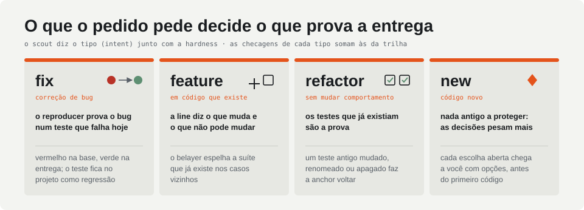
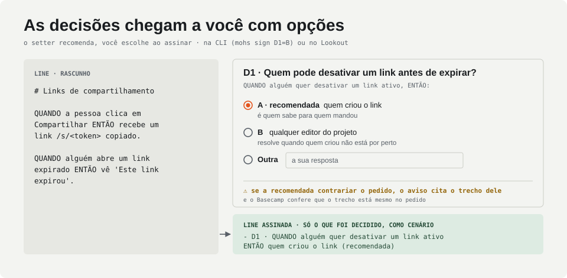
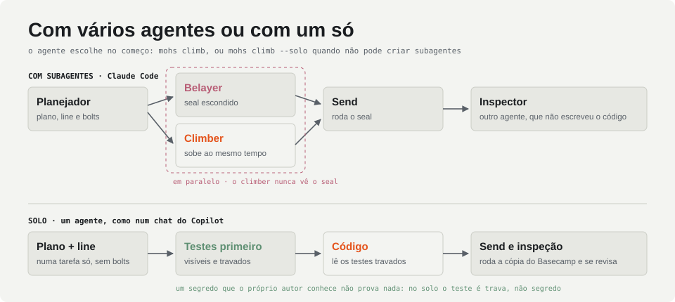
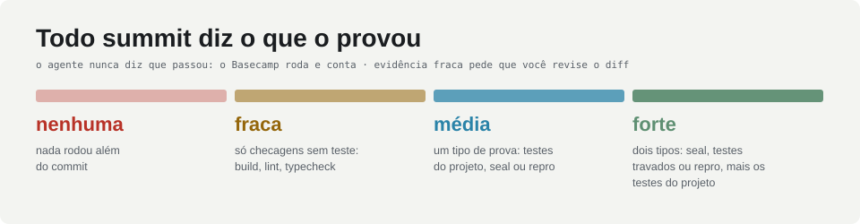
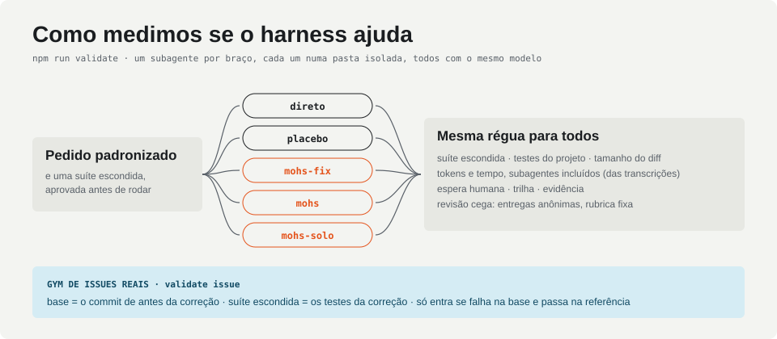

<picture>
  <source media="(prefers-color-scheme: dark)" srcset="docs/assets/readme/hero-dark.svg">
  
</picture>

**MOHs** conduz agentes de código (Claude Code, Copilot, um subagente, um loop próprio com Claude ou Kimi) do pedido à entrega. O fluxo é uma state machine em TypeScript: o agente faz uma tarefa por vez, e quem roda as checagens, faz os commits e decide o próximo passo é o harness. Funciona com vários agentes, um por papel, ou com um só, como num chat do Copilot.

O nome se lê como **Mohs**, a escala de dureza dos minerais; e _harness_, na escalada, é o arnês que segura quem sobe. Cada pedido é um **climb**, cada feature uma **route**, e a dureza (**hardness**) decide quanto rigor o harness aplica.

`Node 24` · `TypeScript sem build` · `Claude Code e Copilot` · `git como detalhe interno` · `monorepos` · `pt-BR`

---

## Por que usar

|                                       |                                                                                                                                                                                                                 |
| ------------------------------------- | --------------------------------------------------------------------------------------------------------------------------------------------------------------------------------------------------------------- |
| **Gates em código, não em prompt**    | Anchor, send, inspeção e brake rodam no harness. O agente nunca diz "os testes passaram": quem roda é o Basecamp, e todo summit diz o que o provou.                                                             |
| **Testes antes do código**            | Com subagentes, o belayer escreve testes que quem implementa não vê. Com um agente só, os testes vêm primeiro e ficam travados: o que roda é a cópia do Basecamp.                                               |
| **Um bug se prova antes de corrigir** | Num pedido de correção, o reproducer escreve um teste que falha hoje. Ele roda na entrega e fica no projeto como teste de regressão.                                                                            |
| **Você decide só o que importa**      | Cada ponto que o pedido deixa aberto chega a você com opções, a recomendada primeiro; você escolhe ao assinar, ou responde com as suas palavras. A spec (line) é assinada presa a um hash.                      |
| **Cerimônia na medida do risco**      | Quatro trilhas, de `talc` a `diamond`, pelo custo de um erro; e o tipo de pedido (bug, feature, refatoração, código novo) traz a prova que cabe nele.                                                           |
| **Seu working copy fica intacto**     | Cada route sobe num git worktree próprio, com as dependências do projeto (inclusive as de cada pacote de um monorepo). A entrega é uma branch pronta para `git merge`.                                          |
| **Qualquer agente, tudo registrado**  | O núcleo não sabe quem faz a tarefa: um agente pela CLI, o loop próprio por API ou uma equipe simulada. Log de eventos, painel ao vivo (Lookout), relatório de cada climb e uma ferramenta para medir se ajuda. |

## Um climb

<picture>
  <source media="(prefers-color-scheme: dark)" srcset="docs/assets/readme/flow-dark.svg">
  
</picture>

O **survey** mapeia o projeto por código, sem gastar tokens. O **scout** divide o pedido em routes e pitches, escolhe a trilha e diz o tipo do pedido. Numa correção de bug, o **repro** prova o bug num teste que falha hoje. A **line** (a spec) chega com as decisões em aberto e espera a sua escolha e a sua assinatura. Acima de fluorite, cada route recebe **bolts** (o contrato de interface) e um **seal** (os testes escondidos), escrito enquanto o climber já sobe. Cada **pitch** termina numa **anchor**: o harness roda as checagens e faz o commit. O **send** roda o seal e a reprodução; se falhar, é uma **fall**, e o climber volta à última anchor sabendo só o comportamento esperado. Depois vêm os revisores (**inspection**) e o **summit**, que você assina quando o climber decidiu algo que a line não dizia. O **descent** só acontece se houve atrito: o scribe propõe melhorias, e você aceita ou não.

## Quatro trilhas, uma régua

<picture>
  <source media="(prefers-color-scheme: dark)" srcset="docs/assets/readme/tracks-dark.svg">
  
</picture>

A dureza mede quanto custa um erro que passe, não o tamanho do pedido: um pedido grande e de baixo risco vira várias routes fluorite, e um tokenizador de 50 linhas pode ser quartz. O scout escolhe entre fluorite, quartz e diamond; `--hardness` força. **Talc** só existe quando você pede (`mohs fix`): o climber faz a correção direto, lista as decisões que tomou, e o Basecamp confere o diff contra limites de tamanho (testes e documentação não contam) e áreas sensíveis. Passou dos limites, a correção pede o fluxo completo. Durante o climb, a dureza só sobe.

## O que o pedido pede decide o que prova a entrega

<picture>
  <source media="(prefers-color-scheme: dark)" srcset="docs/assets/readme/intents-dark.svg">
  
</picture>

Junto com a hardness, o scout diz o tipo do pedido (`intent`), e cada tipo traz as suas checagens. Numa **correção de bug**, o reproducer escreve o teste antes de qualquer plano; o Basecamp confere que ele falha, o climber o vê, o send o roda e ele entra no projeto. Numa **refatoração**, um teste que já existia e foi mudado, renomeado ou apagado faz a anchor voltar. Em **código novo**, não há comportamento antigo a proteger, então o que pesa são as decisões.

## As decisões chegam a você com opções

<picture>
  <source media="(prefers-color-scheme: dark)" srcset="docs/assets/readme/decisions-dark.svg">
  
</picture>

Cada ponto que o pedido não decide (um caso de borda, um valor padrão, uma escolha de API) vira uma decisão: a pergunta, a situação e de duas a três respostas, a recomendada primeiro, cada uma com o porquê. Se a recomendada contraria algo que o pedido diz, o setter cita o trecho e você vê o aviso; o Basecamp confere que o trecho está mesmo no pedido. Você assina com as recomendadas (`mohs sign`), escolhe outra (`mohs sign D1=B`) ou responde com as suas palavras (`mohs sign "D2=…"`), na CLI ou no Lookout. A line assinada guarda só o que foi decidido, como cenário, e é isso que o belayer testa e o climber constrói. Uma escolha que o climber faça sozinho depois também chega a você: ela vai para a assinatura da entrega.

## O teste que o climber não vê

<picture>
  <source media="(prefers-color-scheme: dark)" srcset="docs/assets/readme/seal-dark.svg">
  
</picture>

Entre os harnesses que pesquisamos (BMAD, AI-DLC, Superpowers, Spec Kit, Kiro, OpenSpec e outros), nenhum esconde os testes de quem implementa. O MOHs esconde: o belayer escreve contra a line e os bolts, espelhando os casos que a suíte do projeto já cobre em código parecido, e o harness confere que todo teste falha antes da implementação. O seal é escrito ao mesmo tempo que o climber sobe; só o send espera por ele. A explicação de cada fall passa por um **leak guard** que barra trechos do teste. Se o climber achar que o teste contradiz a line, ele contesta (`dispute`); o belayer mantém ou corrige, e na segunda contestação quem decide é você.

## Com vários agentes ou com um só

<picture>
  <source media="(prefers-color-scheme: dark)" srcset="docs/assets/readme/solo-dark.svg">
  
</picture>

Com subagentes (Claude Code), cada papel roda num agente próprio que só tem as ferramentas do papel (`mohs-planner`, `mohs-reproducer`, `mohs-belayer`, `mohs-climber`, `mohs-inspector`, `mohs-scribe`), e um nome que já foi belayer não pega tarefa de climber. Sem subagentes, como num chat do Copilot, o agente começa com `mohs climb --solo`: o plano e a line vêm numa tarefa só, não há bolts fora do diamond, os testes vêm antes do código, visíveis e travados, e o inspector sabe que foi ele quem escreveu, então procura primeiro os casos que nenhum teste cobre. Um segredo que o próprio autor conhece não prova nada; uma trava prova.

## Todo summit diz o que o provou

<picture>
  <source media="(prefers-color-scheme: dark)" srcset="docs/assets/readme/evidence-dark.svg">
  
</picture>

O grau de evidência sai do que o Basecamp rodou e viu passar: testes selados ou travados, a reprodução do bug, os testes do projeto e as checagens em TypeScript. Aparece na CLI, no Lookout e no relatório. Evidência fraca ou nenhuma vem com o aviso de revisar o diff antes do merge.

---

## Começar

Precisa de **Node 24** (roda `.ts` direto) e **git**; o projeto precisa de pelo menos um commit. Enquanto o pacote não é publicado, instale a partir deste repositório:

```bash
npm install
npm link
```

No projeto:

```bash
mohs init
```

O `init` cria `.mohs/` com os comandos detectados e um **plano de testes**: o que roda os testes selados agora (o runner do projeto, o script de teste dele ou o da linguagem) e o que é recomendado para a stack. Num monorepo, a anchor roda só os pacotes que cada pitch tocou (`npm test -- {packages}`, ou `{filters}` com pnpm e turbo).

Para o agente seguir o MOHs (skill, agentes por papel e hooks):

```bash
mohs agent install claude
```

Use `copilot` no lugar de `claude` para o Copilot. Abra uma sessão nova do agente no projeto e peça, por exemplo, "com o mohs, adicione prioridade às tarefas". A skill faz o agente rodar:

```bash
mohs climb "Adicionar prioridade às tarefas, com filtro na listagem" --detach
```

A saída já traz a primeira tarefa. O agente faz o que ela pede e responde com `mohs call …`; cada resposta volta com o próximo passo. Quando é a sua vez, a CLI mostra as decisões e o comando para assinar. Sem subagentes, o agente usa `--solo`.

Uma correção pequena, sem plano nem line:

```bash
mohs fix "O botão Exportar deve dizer Exportar PNG" --detach
```

Para ver tudo sem agente nenhum, com a equipe simulada e o Lookout no navegador (a line do cenário chega com decisões para você escolher):

```bash
node src/cli.ts climb --crew fake --cwd gym/demo
```

## Comandos

| Comando                                | Para quê                                                                                                           |
| -------------------------------------- | ------------------------------------------------------------------------------------------------------------------ |
| `mohs init [--tests <opção>]`          | cria `.mohs/`, detectando comandos, guidebooks, monorepo e o plano de testes                                       |
| `mohs doctor`                          | valida a configuração e mostra camadas, rack, brake, O₂ e o plano de testes                                        |
| `mohs croqui [--show]`                 | desenha o croqui do projeto (intenção, entidades, áreas sensíveis), assinado por você                              |
| `mohs climb "<pedido>"`                | começa um climb (`--detach` para agentes, `--solo` para um agente só, `--hardness` para forçar, `--crew` a equipe) |
| `mohs fix "<pedido>"`                  | correção pequena (talc): uma tarefa de climber, assinada no fim                                                    |
| `mohs next`                            | o que o climb precisa agora: tarefa, quadro de tarefas, vez do humano ou fim                                       |
| `mohs call <resposta>`                 | responde a tarefa aberta (`plan`, `repro`, `line`, `safe`, `dispute`, `escalate`…)                                 |
| `mohs sign [alvo] [D1=B "D2=…"]`       | assina o que está pendente (line, `bolts-A`, `summit-A`, `croqui`); na line, escolhe as decisões                   |
| `mohs rescue <op>`                     | responde um rescue (`retry`, `abandon`, `proceed`, `abort`)                                                        |
| `mohs climb --resume <id>`             | retoma um climb cujo Basecamp parou, sem refazer o que estava pronto                                               |
| `mohs lookout`                         | sobe o painel ao vivo dos climbs do projeto, onde também se assina e se escolhe                                    |
| `mohs report`                          | gera um `index.html` com a linha do tempo, o plano e as decisões de um climb                                       |
| `mohs beta [accept\|reject <id>]`      | mostra as propostas do scribe e aplica ou descarta cada uma                                                        |
| `mohs agent [install claude\|copilot]` | instruções para o agente; `install` põe a skill, os agentes por papel e os hooks no projeto                        |
| `mohs rack <papel> --files a,b`        | mostra o que entraria no contexto (pack) de um papel                                                               |

## Quem faz o quê

| Papel          | Faz                                                                 | Nunca                                    |
| -------------- | ------------------------------------------------------------------- | ---------------------------------------- |
| **scout**      | lê o pedido e o repositório, planeja routes, pitches, trilha e tipo | altera arquivos                          |
| **reproducer** | num bug, escreve o teste que falha hoje                             | corrige o bug                            |
| **setter**     | escreve a line, as decisões com opções e os bolts                   | escreve código                           |
| **belayer**    | escreve os testes selados e explica as falls                        | mostra um teste a quem implementa        |
| **climber**    | implementa um pitch por vez, no worktree da route                   | faz commit ou diz que os testes passaram |
| **inspector**  | revisa o diff com uma rubrica (segurança, arquitetura, UI…)         | decide o que bloqueia (é o brake)        |
| **scribe**     | lê o atrito do climb e propõe melhorias                             | aplica algo sem você escolher            |

O planejador (`mohs-planner`) faz o scout e o setter com o mesmo nome: quem explorou o projeto para o plano já o conhece para a line. Os limites que as regras definem viram hooks: com `mohs agent install`, o que é proibido é negado na hora, com o motivo.

## Configuração

Camadas, da mais fraca para a mais forte: núcleo, guidebooks (`extends`), `~/.mohs`, o `.mohs/` do projeto e as flags.

```yaml
extends: ["mohs:react", "mohs:monorepo"]

commands:
  anchor: ["npm run typecheck", "npm test -- {packages}"] # ao fim de cada pitch; {packages} = pacotes tocados
  send: ["npm test"] # suíte completa, em diamond
  seal: "npm test -- {file}" # como rodar um teste selado (sem isto: node --test, python3, sh)

models:
  climber: moonshot/kimi-k2.7-code # para o loop próprio (--crew api)
```

O projeto estende o harness pelas bordas: **skills** em `.mohs/rack/`, conhecimento do projeto (**beta**) em `.mohs/beta/`, **inspectors** em `.mohs/inspectors/` e **checks** em TypeScript em `.mohs/checks/`. Nenhuma extensão afrouxa o brake.

## Como medimos se ajuda

<picture>
  <source media="(prefers-color-scheme: dark)" srcset="docs/assets/readme/validation-dark.svg">
  
</picture>

`npm run validate` roda o mesmo pedido em braços isolados, cada um num subagente: o agente sozinho, um placebo com a mesma quantidade de instrução em texto, e o MOHs em três modos. Todos são julgados pela mesma suíte escondida, aprovada antes de rodar, pelo custo (tokens de todos os subagentes, lidos das transcrições) e por uma revisão cega das entregas. O **gym de issues reais** (`npm run validate -- issue`) parte do commit de antes de uma correção real e usa os testes da correção como suíte escondida; a issue só entra se a suíte falha na base e passa inteira na referência.

O que as rodadas mostraram até aqui:

- Em pedidos pequenos e bem especificados, o agente sozinho já acerta tudo e o harness empata.
- A diferença de custo caiu de 5 a 6 vezes para 1,2 a 2,7 vezes o agente sozinho.
- Numa correção real do React, o mohs-solo não quebrou nenhum caso válido; a primeira correção oficial quebrou dois.

O gym de issues é onde a vantagem precisa aparecer, com três repetições por braço. O protocolo está em [`docs/VALIDATION.md`](docs/VALIDATION.md).

## Estado

O núcleo cobre as quatro trilhas e os quatro tipos de pedido de ponta a ponta, com agentes reais e simulados, com subagentes e em modo solo. Validado com subagentes em projetos de ginásio e numa issue real do React; falta rodar o gym de issues com repetições e testar o Copilot ao vivo.

<details>
<summary>Fases entregues</summary>

- **1** · Basecamp (state machine e log de eventos), configuração em camadas, rack e pack determinísticos, brake, leak guard, equipe simulada e Lookout.
- **2** · Agentes reais (Anthropic pelo SDK oficial e provedores compatíveis com OpenAI, como o Kimi), survey sem LLM, worktrees e a trilha fluorite.
- **3** · Núcleo agnóstico: o Basecamp publica tarefas com respostas tipadas, e um driver as executa (`agent`, `api`, `fake`).
- **4** · Quartz: bolts, seal guardado fora do projeto e conferido vermelho, send em checkout separado, FALL com leak guard, inspectors e scribe.
- **5** · Diamond com assinaturas de bolts e entrega, checks em TypeScript, `mohs beta` e hooks para Claude Code e Copilot.
- **5.1** · Dependências entre routes, branch de entrega testada junta, posse de tarefa por agente e `mohs report`.
- **5.2** · Bolts e seal por route, diff numerado para os inspectors, quadro de tarefas, separação entre belayer e climber.
- **5.3** · Trilha talc (`mohs fix`), grau de evidência em todo summit, seal sem configuração em Node e Python.
- **5.4** · Plano de testes no `init`, teto do belayer, contestação do seal, retomada pelo log e o croqui.
- **5.5** · Seal em paralelo com a subida, modo solo com testes travados, agentes por papel, decisões com opções na assinatura.
- **5.6** · Monorepos (dependências por pacote, checagens só nos pacotes tocados), decisões do climber assinadas na entrega.
- **5.7** · Tipo de pedido com a sua cerimônia, reproducer, solo mais curto e o gym de issues reais.

</details>

<details>
<summary>Léxico</summary>

| Termo                    | O que é                                                 |
| ------------------------ | ------------------------------------------------------- |
| **Climb**                | um pedido, do começo ao fim                             |
| **Route** / **Pitch**    | uma feature, com worktree próprio / uma tarefa dela     |
| **Line**                 | a spec, com as decisões, assinada por você              |
| **Decisão**              | um ponto que o pedido deixou aberto, com opções         |
| **Intent**               | o tipo de pedido: fix, feature, refactor ou new         |
| **Repro**                | o teste que prova o bug antes da correção               |
| **Bolts**                | o contrato de interface                                 |
| **Seal**                 | os testes escritos antes e escondidos do climber        |
| **Anchor**               | checagem ao fim do pitch e commit                       |
| **Send** / **Fall**      | o seal e a reprodução rodam contra a route / e falharam |
| **Summit** / **Descent** | a entrega / a retrospectiva                             |
| **Basecamp**             | a state machine que conduz tudo                         |
| **Brake**                | o motor de política (e os hooks)                        |
| **O₂**                   | o orçamento de tokens                                   |
| **Croqui**               | o retrato curto e assinado do projeto                   |

</details>

## Documentos

- [`docs/ARCHITECTURE.md`](docs/ARCHITECTURE.md): o desenho, as decisões e o roadmap (a fonte da verdade).
- [`docs/VALIDATION.md`](docs/VALIDATION.md): como medimos o harness, com e sem MOHs, em braços isolados e em issues reais.
- [`docs/identidade.html`](docs/identidade.html): identidade visual e vocabulário.
- [`reports/`](reports/): a síntese da pesquisa sobre os frameworks de agentes que orientou o desenho.

## Desenvolvimento

```bash
npm test                   # a suíte, com git e worktrees de verdade
npm run typecheck
npx prettier --check .
npm run validate -- list   # validações do harness (docs/VALIDATION.md)
```

As imagens deste README saem de `docs/assets/readme/render.ts`, com os tokens da identidade: `node docs/assets/readme/render.ts` as gera de novo, em versão clara e escura.

## Licença

[MIT](LICENSE).
